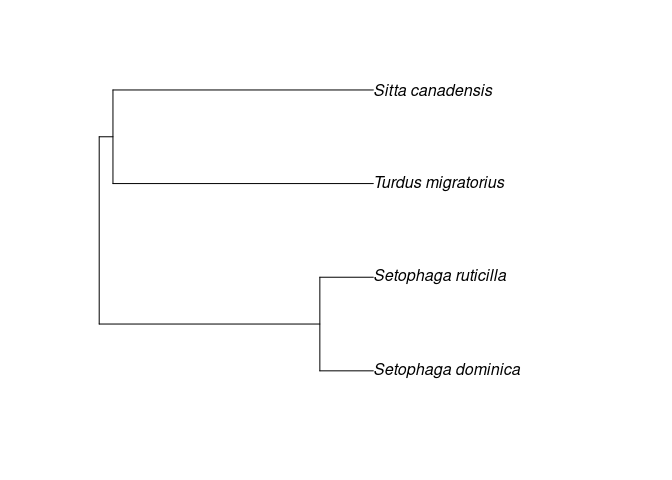
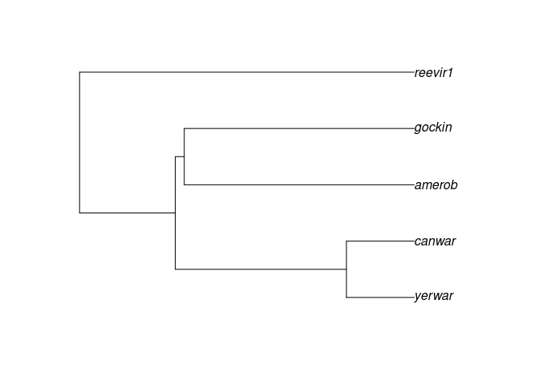

BasicTutorial
================
2025-04-03

## Installing clootl

clootl is currently in review at CRAN. For the time being you can
install it from Github using devtools

``` r
install.packages("devtools")
library(devtools)  
install_github("eliotmiller/clootl")
```

``` r
library(clootl)
```

    ## Loading required package: ape

    ## To cite package 'clootl' in publications use:
    ## 
    ##   Miller E, McTavish E, Sanchez-Reyes L (2025). "clootl: Fetch and
    ##   Explore the Cornell Lab of Ornithology Open Tree of Life Avian
    ##   Phylogeny." <https://github.com/eliotmiller/clootl>.
    ## 
    ##   McTavish E, Gerbracht J, Holder M, Iliff M, Lepage D, Rasmussen P,
    ##   Redelings B, Sanchez-Reyes L, Miller E (2025). "A complete and
    ##   dynamic tree of birds." _Proceedings of the National Academy of
    ##   Sciences_.
    ## 
    ## To see these entries in BibTeX format, use 'format(<citation>,
    ## bibtex=TRUE)', or 'toBibtex(.)'.
    ## 
    ## The current version of the Aves tree is v1.4.
    ##         Please specify the tree and taxonomy version used when citing this R package.
    ##         When possible, cite all the original studies supporting your tree:
    ##         These citations are acessible using getCitations(your_tree)

## Getting a tree

The most recent version of the tree is available with the package. You
can easily get a subtree using “extractTree” and a list of scientific
names. This defaults tree version 1.4 and to the names in the 2023
taxonomy.

If you don’t give it any arguments, it will return the whole tree
(~11,000 tips)

``` r
ex1 <- extractTree(species=c("Turdus migratorius",
                             "Setophaga dominica",
                             "Setophaga ruticilla",
                             "Sitta canadensis"))

plot(ex1)
```

<!-- -->

You should cite the author’s whose work went into generating these
relationships whenever possible. You can get the citations to the input
phylogenies using ‘getCitations’.

``` r
cites <- getCitations(ex1)
cites
```

    ##                  study
    ## 1               ot_290
    ## 2               ot_412
    ## 3               ot_809
    ## 4              ot_2013
    ## 5              ot_2312
    ## 6               ot_521
    ## 7               ot_770
    ## 8               ot_783
    ## 9              pg_2015
    ## 10             pg_2404
    ## 11             pg_2591
    ## 12             pg_2913
    ## 13 Taxonomic additions
    ##                                                                                                                                                                                                                                                                                                                                                                                                            reference
    ## 1                                                                                                                                                                          Selvatti, Alexandre Pedro, Luiz Pedreira Gonzaga, Claudia Augusta de Moraes Russo. 2015. A Paleogene origin for crown passerines and the diversification of the Oscines in the New World. Molecular Phylogenetics and Evolution 88: 1-15.
    ## 2                                                                                                                                                                                                                                                         Barker, F.K. 2014. Mitogenomic data resolve basal relationships among passeriform and passeridan birds. Molecular Phylogenetics and Evolution 79: 313-324.
    ## 3                                                                                                                                                                                                                                                                    Jetz, W., G. H. Thomas, J. B. Joy, K. Hartmann, A. O. Mooers. 2012. The global diversity of birds in space and time. Nature 491 (7424): 444-448
    ## 4                                                                                                                                              Oliveros, C. H., Field, D. J., Ksepka, D. T., Barker, F. K., Aleixo, A., Andersen, M. J., … Faircloth, B. C. (2019). Earth history and the passerine superradiation. Proceedings of the National Academy of Sciences, 116(16), 7916–7925. doi:10.1073/pnas.1813206116
    ## 5                                                                                                                                                                                                                                             Stiller, J., Feng, S., Chowdhury, AA. et al. Complexity of avian evolution revealed by family-level genomes. Nature (2024). https://doi.org/10.1038/s41586-024-07323-1
    ## 6                                                                                                                                                                                                                           Burleigh, J. Gordon, Rebecca T. Kimball, Edward L. Braun. 2015. Building the avian tree of life using a large-scale, sparse supermatrix. Molecular Phylogenetics and Evolution 84: 53-63
    ## 7                                                                                                                                               Barker, F. Keith, Kevin J. Burns, John Klicka, Scott M. Lanyon, Irby J. Lovette. 2015. New insights into New World biogeography: An integrated view from the phylogeny of blackbirds, cardinals, sparrows, tanagers, warblers, and allies. The Auk 132 (2): 333-348.
    ## 8                                                                                                                           Moyle, Robert G., Carl H. Oliveros, Michael J. Andersen, Peter A. Hosner, Brett W. Benz, Joseph D. Manthey, Scott L. Travers, Rafe M. Brown, Brant C. Faircloth. 2016. Tectonic collision and uplift of Wallacea triggered the global songbird radiation. Nature Communications 7: 12709
    ## 9                                                                                                                                                                                                                                                  Odeen, A., Hastad O., & Alstrom P. 2011. Evolution of ultraviolet vision in the largest avian radiation - the passerines. BMC Evolutionary Biology 11 (313): 1-8.
    ## 10                                                                                                                                                        Barker, F. Keith, Alice Cibois, Peter Schikler, Julie Feinstein, Joel Cracraft. 2004. Phylogeny and diversification of the largest avian radiation. Proceedings of the National Academy of Sciences of the United States of America 101 (30): 11040-11045.
    ## 11 Lovette, Irby J., Jorge L. Pérez-Emán, John P. Sullivan, Richard C. Banks, Isabella Fiorentino, Sergio Córdoba-Córdoba, María Echeverry-Galvis, F. Keith Barker, Kevin J. Burns, John Klicka, Scott M. Lanyon, Eldredge Bermingham. 2010. A comprehensive multilocus phylogeny for the wood-warblers and a revised classification of the Parulidae (Aves). Molecular Phylogenetics and Evolution 57 (2): 753-770.
    ## 12                                                                           Price, Trevor D., Daniel M. Hooper, Caitlyn D. Buchanan, Ulf S. Johansson, D. Thomas Tietze, Per Alström, Urban Olsson, Mousumi Ghosh-Harihar, Farah Ishtiaq, Sandeep K. Gupta, Jochen Martens, Bettina Harr, Pratap Singh, Dhananjai Mohan. 2014. Niche filling slows the diversification of Himalayan songbirds. Nature 509: 222-225.
    ## 13                                                                                                                                                                                                                                                                                                                                                                                                     Miller et al.
    ##                                              doi contribution
    ## 1  http://dx.doi.org/10.1016/j.ympev.2015.03.018     66.66667
    ## 2  http://dx.doi.org/10.1016/j.ympev.2014.06.011     66.66667
    ## 3          http://dx.doi.org/10.1038/nature11631     66.66667
    ## 4      http://dx.doi.org/10.1073/pnas.1813206116     33.33333
    ## 5     https://doi.org/10.1038/s41586-024-07323-1     33.33333
    ## 6  http://dx.doi.org/10.1016/j.ympev.2014.12.003     33.33333
    ## 7         http://dx.doi.org/10.1642/auk-14-110.1     33.33333
    ## 8          http://dx.doi.org/10.1038/ncomms12709     33.33333
    ## 9     http://dx.doi.org/10.1186/1471-2148-11-313     33.33333
    ## 10     http://dx.doi.org/10.1073/pnas.0401892101     33.33333
    ## 11 http://dx.doi.org/10.1016/j.ympev.2010.07.018     33.33333
    ## 12         http://dx.doi.org/10.1038/nature13272     33.33333
    ## 13        https://github.com/eliotmiller/addtaxa      0.00000

To get the tree using a different taxonomy year, use the argument
“taxonomy_year”. Current options are 2021, 2022. And 2024 is coming
soon.

``` r
ex2 <- extractTree(species=c("Turdus migratorius",
                             "Setophaga dominica",
                             "Setophaga ruticilla",
                             "Sitta canadensis"),
                             taxonomy_year = 2021)
```

You can also use eBird codes as tip labels,.

``` r
ex3 <- extractTree(species=c("amerob",
                             "canwar",
                             "reevir1",
                             "yerwar",
                             "gockin"), 
                              label_type="code")
plot(ex3)
```

<!-- -->
