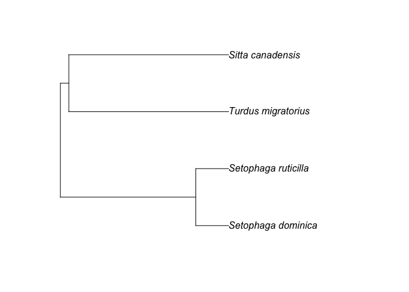
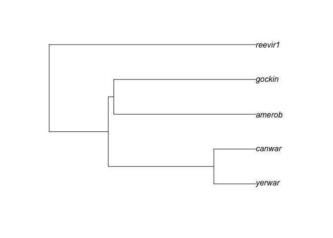

# Getting Started

## Installing clootl

We recommend installing clootl directly from GitHub.

``` r
install.packages("devtools")
library(devtools)  
install_github("eliotmiller/clootl")
```

``` r
library(clootl)
```

```         
## Loading required package: ape

## To cite package 'clootl' in publications use:
## 
##   Miller E, McTavish E, Sanchez-Reyes L (2025). "clootl: Fetch and
##   Explore the Cornell Lab of Ornithology Open Tree of Life Avian
##   Phylogeny." <https://github.com/eliotmiller/clootl>.
## 
##   McTavish E, Gerbracht J, Holder M, Iliff M, Lepage D, Rasmussen P,
##   Redelings B, Sanchez-Reyes L, Miller E (2025). "A complete and
##   dynamic tree of birds." Proceedings of the National Academy of
##   Sciences 122:e2409658122.
## 
## To see these entries in BibTeX format, use 'format(<citation>,
## bibtex=TRUE)', or 'toBibtex(.)'.
## 
## The current version of the Aves tree is v1.6.
##         Please specify the tree and taxonomy version used when citing this R package.
##         When possible, cite all the original studies supporting your tree:
##         These citations are acessible using getCitations(your_tree)
```

## Getting a tree

The most recent version of the tree is available with the package. You can easily get a subtree using `extractTree` and a list of scientific names of species codes. This defaults to tree version 1.6 and to the names and codes in the 2025 Clements taxonomy. The official version of that file can be found [here](https://www.birds.cornell.edu/clementschecklist/introduction/updateindex/october-2025/2025-citation-checklist-downloads/), and the version used by clootl, which also provides a match to Open Tree taxonomy, can be found in clootl itself:

``` r
head(clootl_data$taxonomy.files$year2025)
```

If you don’t give `extractTree` any arguments, it will return the whole tree (\~11,000 tips). Here's a much smaller tree (for example purposes):

``` r
ex1 <- extractTree(species=c("Turdus migratorius",
                             "Setophaga dominica",
                             "Setophaga ruticilla",
                             "Sitta canadensis"))

plot(ex1)
```

<!-- -->

You should cite all the critical contributing papers that went into generating these relationships whenever possible. You can get the citations of the input phylogenies using `getCitations`.

``` r
# get the citation information
cites <- getCitations(ex1)

# abbreviate what prints to screen (for example purposes only)
cites$reference.trunc <- stringr::str_trunc(cites$reference, 30)

# print to screen
cites[,c("study", "reference.trunc", "doi", "contribution")]
```

```         
                 study                reference.trunc                                           doi contribution
1               ot_290 Selvatti, Alexandre Pedro, ... http://dx.doi.org/10.1016/j.ympev.2015.03.018     66.66667
2               ot_412 Barker, F.K. 2014. Mitogeno... http://dx.doi.org/10.1016/j.ympev.2014.06.011     66.66667
3              ot_1195 Hooper, Daniel M., Trevor D...   http://dx.doi.org/10.1038/s41559-017-0284-6     33.33333
4              ot_2013 Oliveros, C. H., Field, D. ...     http://dx.doi.org/10.1073/pnas.1813206116     33.33333
5              ot_2312 Stiller, J., Feng, S., Chow...    https://doi.org/10.1038/s41586-024-07323-1     33.33333
6              ot_2763 Zhao, M., Oswald, J. A., Al...   https://doi.org/10.1016/j.ympev.2024.108235     33.33333
7              ot_2879 Claramunt, S., Sheard, C., ...     https://doi.org/10.1016/j.cub.2025.07.004     33.33333
8              ot_3077 Zhao, M., Thom, G., Fairclo...        https://doi.org/10.1093/sysbio/syaf080     33.33333
9              ot_3078 Bennett, K. F. P., Wood, A....  https://doi.org/10.1371/journal.pbio.3003501     33.33333
10              ot_783 Moyle, Robert G., Carl H. O...         http://dx.doi.org/10.1038/ncomms12709     33.33333
11              ot_809 Jetz, W., G. H. Thomas, J. ...         http://dx.doi.org/10.1038/nature11631     33.33333
12             pg_2015 Odeen, A., Hastad O., & Als...    http://dx.doi.org/10.1186/1471-2148-11-313     33.33333
13             pg_2404 Barker, F. Keith, Alice Cib...     http://dx.doi.org/10.1073/pnas.0401892101     33.33333
14             pg_2591 Lovette, Irby J., Jorge L. ... http://dx.doi.org/10.1016/j.ympev.2010.07.018     33.33333
15             pg_2913 Price, Trevor D., Daniel M....         http://dx.doi.org/10.1038/nature13272     33.33333
16 Taxonomic additions                  Miller et al.        https://github.com/eliotmiller/addtaxa      0.00000
```

To get the tree using a different taxonomy year, use the argument “taxonomy_year”. Current options are 2021-2025, though not all topology/taxonomy combinations are available. We are in the process of updating how different tree versions are accessed, so the naming convention here may change in the near future.

``` r
ex2 <- extractTree(species=c("Turdus migratorius",
                             "Setophaga dominica",
                             "Setophaga ruticilla",
                             "Sitta canadensis"),
                             taxonomy_year = 2021)
```

You can also use eBird codes as tip labels:

``` r
ex3 <- extractTree(species=c("amerob",
                             "canwar",
                             "reevir1",
                             "yerwar",
                             "gockin"), 
                              label_type="code")
plot(ex3)
```

<!-- -->
