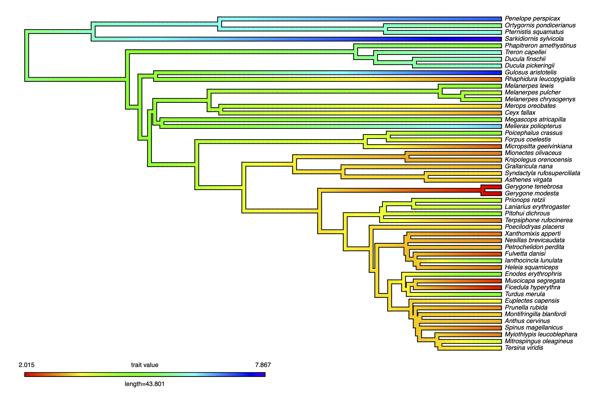
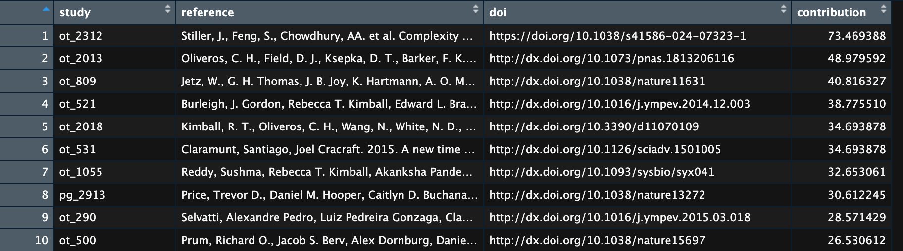

# Summary

We present `clootl`, an R package to access a modern and dynamic phylogeny of the world's birds. The package's name draws inspiration from the collaboration that gave rise to it, a joint effort between the Cornell Lab of Ornithology (CLO) and the Open Tree of Life (OpenTree, or OTL) project. The primary functions of the package are to provide access to the tree across a range of taxonomy and synthesis versions, as well as to identify and properly acknowledge the constituent studies that went into creating these phylogenies. These citation functions can flexibly handle tree pruning, so that the acknowledged studies reflect the subset of the data output by a user. While the raw outputs of the new synthetic tree are readily available from a GitHub repository, `clootl` provides a simple interface for easy access and citation. Given the demonstrated need for a global avian phylogeny, and the fact that phylogenies are often manipulated within the R environment, we believe `clootl` will be a frequently used access point to the newly released global avian phylogeny.

# Statement of need

A global avian phylogeny is a key resource for research and conservation. Existing examples [@jetz2012global] are widely used, but also badly outdated. Because portions of the global phylogeny are perpetually being improved, rather than publishing a single global version that would quickly become outdated, we have built a dynamic resource that can be updated and improved over time [@mctavish_complete_2024]. The immediate outputs from such a tool, however, are more extensive and not necessarily as easy to navigate as previously available global phylogenies. To simplify access, facilitate research reproducibility (access to specific tree versions and taxonomies), and ensure component datasets are properly attributed by users of the tree, we built the R package `clootl` [@miller_clootl_2025].

# Example Use Case

An important feature of our new phylogeny is its interoperability and connection to existing databases and resources. As an example of this feature, we illustrate how the phylogeny can be connected to AVONET [@tobias_avonet_2022], a database of morphological measurements for the world's birds.

To access AVONET, use the `readxl` [@wickham2019package] package to access the database directly from Figshare.

```         
library(readxl)

# Define the file URL and destination
file_url <- "https://figshare.com/ndownloader/files/34480856"
destfile <- tempfile(fileext = ".xlsx")

# Download the file
download.file(file_url, destfile, mode = "wb")

# Read the sheet that corresponds to eBird taxonomy
dat <- as.data.frame(read_excel(destfile, sheet = "AVONET2_eBird"))

# Create a column with underscores for simplicity later
dat$underscores <- sub(" ", "_", dat$Species2)
```

Importantly, AVONET was published in the 2021 version of the eBird/Clements taxonomy [@clements_ebird/clements_2019]. For this example, to match the phylogeny to the trait dataset, we to extract a phylogeny in 2021 taxonomy.

```         
# Take a random sample of 50 species
spp <- sample(dat$Species2, 50)

# Extract a tree for these species
prunedTree <- extractTree(species=spp, label_type="scientific", taxonomy_year=2021, version="1.4")
```

This leaves us with a paired dataset and phylogeny. Align these further, and use `phytools` [@revell2024phytools] to visualize the distribution of body mass across the phylogeny of these 50 random taxa.

```         
library(phytools)
prunedDat <- dat[dat$Species2 %in% spp,]

# Pull a vector of traits out, log transform for normality
x <- log(prunedDat$Mass)
names(x) <- prunedDat$underscores

# Plot log body mass across the phylogeny
contMap(prunedTree, x, fsize=0.5)
```



Last, figure out what studies went into informing the pruned phylogeny. The output should look like the example below.

```         
toCite <- getCitations(prunedTree)
```



# Discussion

The Open Tree of Life (OpenTree) project synthesizes published phylogenetic information to create a tree of all life. A rich suite of OpenTree software resources already exists for curating and interacting with the input phylogenies [@mctavish2015phylesystem], and this includes both online tools as well as R [@michonneau2016rotl] and Python [@mctavish2021opentree] packages for programmatic interaction with outputs. While, to date, OpenTree has largely succeeded in creating and making these resources available to the broad research community, use of the tools, particularly by the ornithology community has been limited. This is because, while dozens of bird phylogenies are published annually, few were actually curated in the OpenTree system, which limited the downstream quality of the synthetic OpenTree tree, which led to limited use. In addition, the flexible taxonomic approach used by OpenTree to facilitate data interoperability did not exactly match the curated taxonomic treatments in use by ornithogists.\
Nonetheless, the need for a dynamic, updated, high-quality phylogeny of all birds was clear. For example, existing but outdated resources have had an outstanding impact on research, and still see hundreds of published use cases per year [@jetz2012global]. Thus, to help OpenTree fulfill its potential in the avian domain, and start a positive feedback loop of community buy-in, we developed a partnership between the Cornell Lab of Ornithology and OpenTree to begin careful phylogenetic and taxonomic curation of the avian phylogeny. The Cornell Lab of Ornithology is a world-leader in the study and conservation of the world’s birds, with a mission to interpret and conserve the earth’s biological diversity through research, education, and community science focused on birds, and their expertise in this domain has powered community engagement with the project. OpenTree has developed software for efficiently and reproducibly integrating large sets of phylogenetic estimates. By linking these resources together, we built and share an up-to-date, dynamic, phylogenetic estimate capturing all known bird species. This tree is synchronized directly with CLO's annually updated taxonomy [@clements_ebird/clements_2019].\
The data products from this project are shared in a data deposit on GitHub (AvesData)[<https://github.com/McTavishLab/AvesData>] and are easily accessible and usable through this `clootl` R package. As new data becomes available, the data store will be updated, and the new estimates will also be accessible via the `clootl` package. The software we present here provides an interface for interacting with the clootl products, including taxonomy files, synthetic phylogenies in multiple versions, sets of trees capturing uncertainty in estimates and in dates, and associated bibliographic information about the inputs. `clootl` thus provides direct and easy access to the dynamic outputs from our collaboration–a new and perpetually improving phylogeny of the world's birds.

# References
